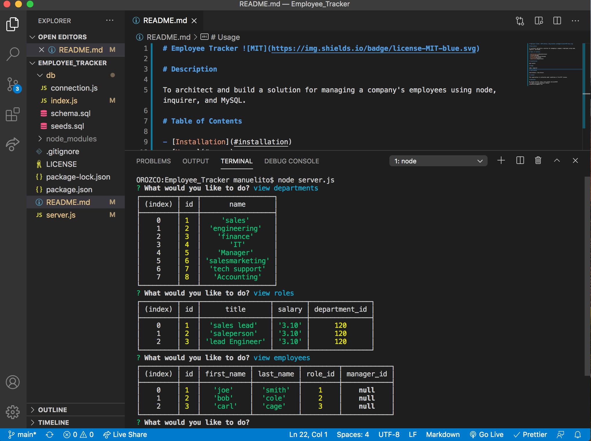

# Employee Tracker 

# Description

To architect and build a solution for managing a company's employees using node, inquirer, and MySQL.

# Table of Contents

- [Installation](#installation)
- [Usage](#usage)
- [Contributed](#contributed)
- [License](#license)
- [Questions](#questions)

# Installation

npm install

# Usage

node, inquirer

# Contributed

Contributers: Jose Orozco

# License

This application is protected under conditions of the MIT license.

# Questions

My Github Profile: http://www.github.com/jose8160  
 If there are any questions contact
jose816orozco@gmail.com
